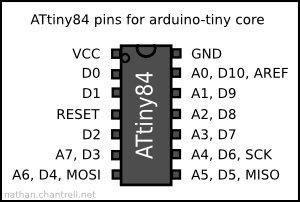

# Eirinn's 7-segment hex decoder

Implemented using an Attiny84. This is for driving a common-anode 7-segment display. Use a 220-ohm resistor on the anode. Place a 10-100nF capacitor across Vcc and ground. Vcc should be 3-5V.

Pin | Usage
----|----
D0 | input bit 3
D1 | input bit 2
D2 | input bit 1
D3 | input bit 0
D4 | segment A
D5 | segment B
D6 | segment C
D7 | segment D
D8 | segment E
D9 | segment F
D10 | segment G

